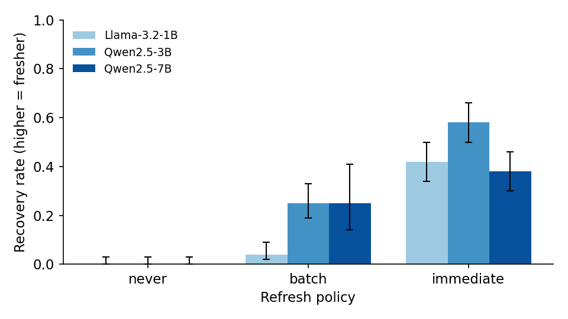

# StaleBench

> A benchmark that measures answer freshness in Retrieval-Augmented Generation (RAG) systems.

[](https://zenodo.org/records/20710012)

**Version 0.2.1** · Code: Apache-2.0 · Data: CC-BY-4.0 · [Read the paper](https://doi.org/10.5281/zenodo.20710012)

Most freshness tools check the index. They ask: is the new document stored? StaleBench checks the answer. It asks: after a fact changes, how long until the system gives the new answer, and how often does it keep giving the old one?

A fresh index does not guarantee a fresh answer. StaleBench measures the gap.

## What it measures

- **Catch-up latency**: the number of steps from a fact changing until the answer becomes correct and stays correct.
- **Stale-answer rate**: the share of facts whose answer is still wrong after the change. The complement, the recovery rate, is reported with a Wilson 95 percent confidence interval.

These are measured across refresh policies (never, batch, immediate) and across any system you connect.

The benchmark controls the documents, the clock, and the correct answers. So answers are scored by exact match, with no language model acting as a judge. Results are reported over many trials, so they stay stable even though model outputs vary.

## Why it matters

A RAG system can index a new document the instant it arrives and still answer with the old value. When both the old and the new document are retrieved together, the model has to choose, and it does not always choose the new one. Index-level freshness metrics cannot see this failure because the index is correct. StaleBench measures it at the answer level, where the user actually feels it.

## Install

```bash
pip install -r requirements.txt
```

This installs numpy, scikit-learn, and openai. For the dense retriever, also install sentence-transformers.

## Quick start

Point it at any OpenAI-compatible endpoint, such as OpenAI, OpenRouter, vLLM, Ollama, or LM Studio:

```bash
python -m stalebench --model qwen2.5-3b-instruct --base-url http://localhost:1234/v1
```

Example output:

```
never      recovery=0.00 CI[0.0, 0.03]
batch      recovery=0.25 CI[0.19, 0.33]
immediate  recovery=0.58 CI[0.50, 0.66]
```

## Benchmark your own RAG system

Write two methods:

```python
from stalebench import RAGSystem, make_scenario, benchmark

class MyRAG(RAGSystem):
    def index(self, documents):   # build or refresh your retrieval index
        ...
    def answer(self, query):      # run your retrieve and generate, return a string
        ...

aggregate, _ = benchmark(MyRAG(), make_scenario(n_facts=24), trials=3)
```

Any system that can take a set of documents and answer a query can be measured. See `examples/custom_system.py`.

## Scoring

An `AnswerChecker` decides if an answer is correct. The default `TokenChecker` matches whole words, so a value like "Park" is not matched inside "Parkinson". You can write your own checker for other value types, such as numbers or dates.

## Findings



In experiments across model sizes, retrievers, and many random scenarios:

- About 40 to 60 percent of answers stay stale even with immediate re-indexing. A fresh index does not give a fresh answer.
- The cause is position. When both the old and new documents are retrieved, the model tends to follow document order, not recency.
- Placing the newest document last (the `--recency-order` option) reduces the problem. It helps most for models with the strongest position bias.

The full tables, with confidence intervals and sensitivity sweeps, are in `results/RESULTS.md`.

## Related work

StaleBench is positioned against the closest prior work so the contribution is clear:

- **HoH** (Evaluating the Impact of Outdated Information on RAG, arXiv:2503.04800) is a static question-answer dataset that measures how outdated documents degrade answer quality. It does not model a clock, refresh policies, or time to recover.
- **DRAGOn** (Designing RAG on a Periodically Updated Corpus, arXiv:2507.05713) keeps the benchmark itself fresh to avoid data leakage and scores with a language-model judge. It does not measure how long a system's answer stays stale.

StaleBench is different on three points together: it measures catch-up latency at the answer level, across explicit refresh policies on a clock, and it ships as a reusable tool you point at your own RAG system. It also names the mechanism behind the staleness (document order) and provides a fix that follows from it.

## Repository layout

```
stalebench/            the library (corpus, system, runner, metrics, backends, reference RAG)
examples/              a minimal custom RAGSystem you can copy
tests/                 metric-validation and checker tests
results/               experiment data (RESULTS.md and raw per-fact records), CC-BY-4.0
```

## Scope and limits

- It works for any RAG system whose documents you can change and refresh. A closed system where you cannot change the documents cannot be measured.
- The exact numbers depend on the scenario, as with any benchmark. StaleBench measures relative freshness and shows the size of the problem in a reliable way. Use your own data for conclusions about your own system.
- The included scenario uses controlled, synthetic facts with single-value questions. The reported experiments use small and mid-size open models served locally.

## Validate the metric

```bash
python -m pytest -q
```

The test in `tests/test_ruler.py` checks that a fresh system scores higher than a stale one. If the metric cannot tell them apart, it is broken.

## How to cite

If you use StaleBench in your work, please cite the paper:

```bibtex
@misc{singh_stalebench_2026,
  author = {Singh, Karan},
  title  = {{StaleBench: A Benchmark for Answer Freshness in
            Retrieval-Augmented Generation}},
  year   = {2026},
  doi    = {10.5281/zenodo.20649015},
  url    = {https://doi.org/10.5281/zenodo.20649015}
}
```

The repository also includes a `CITATION.cff` file, so you can use the "Cite this repository" button on the project page.

## License

The source code is licensed under the Apache License, Version 2.0 (see `LICENSE`). The experiment data in `results/` is licensed under the Creative Commons Attribution 4.0 International License (see `results/LICENSE`). Both allow free use, including commercial use, as long as you give credit.
